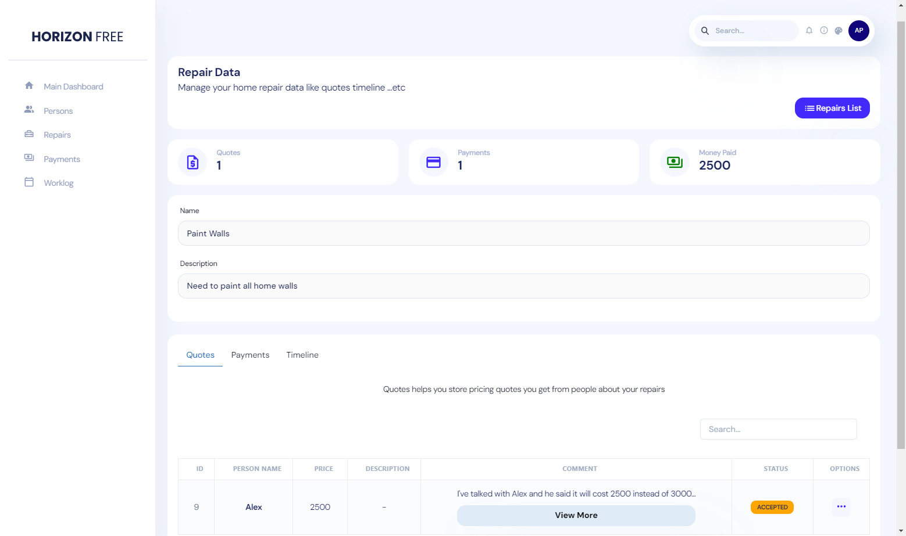
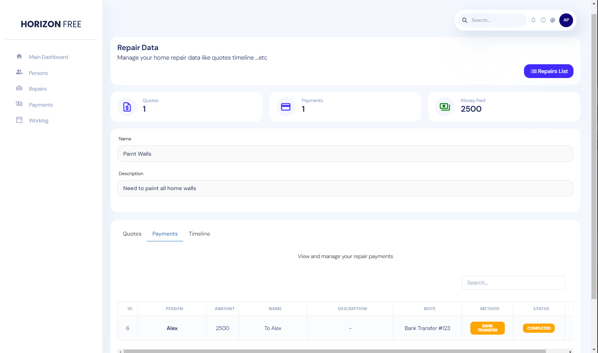

```text
[] Author: Suleiman Jaber
[] Email: soleman630@gmail.com
[] Date: 17 Aug 2023
```

# ReactJS Home Repairs Management

### Introduction

A ReactJS web application for management your home repairs.

Are you tired of keeping track of home repairs, workers, payments, and work logs? Look no further! Introducing my latest creation: the ReactJS Home Repairs Management web application. 🛠️✨

## Experience Seamless Home Repair Management

Are you ready to simplify your life and stay on top of all your home repair tasks? With the `ReactJS Home Repairs Management` app, you can effortlessly manage every aspect of your home repairs, all in one place.

🔹 **Stay Organized:** Keep track of all your persons, workers, repairs, and payments with ease. No more juggling multiple spreadsheets or notes!

🔹 **Effortless Management:** Manage repairs and their statuses, ensuring you're always aware of what's in progress or completed.

🔹 **Financial Clarity:** Handle repair payments seamlessly, making sure you never miss a payment or lose track of your expenses.

🔹 **Detailed Worklog:** Manage your repairs worklog effectively, ensuring that every task and update is recorded for a comprehensive overview.

## Project Highlights

🎉 **Persons and Workers:** Maintain a comprehensive list of persons and workers, making communication and coordination smoother than ever.

🎉 **Repairs at a Glance:** Visualize all your home repairs in one place, allowing you to prioritize tasks effectively.

🎉 **Quote Storage:** Store pricing quotes obtained from various sources, ensuring you make informed decisions about your repairs.

🎉 **Streamlined Payments:** Keep a record of repair payments, guaranteeing that financial aspects are managed efficiently.

🎉 **Interactive Timeline:** Utilize the timeline feature to add comments and updates, providing clear insights into each repair's progress.

🎉 **Efficient Worklog:** Manage worklog details for your repairs workers, ensuring everyone is on the same page and tasks are completed promptly.

---

### Persons List
View all of your persons and workers


### Persons List (Options dropdown)
You can edit, view worklog & view debts of a person


### Repairs List Page
View all of your home repairs


### Repair Data Page (Quotes)
Quotes helps you store pricing quotes you get from people about your repairs



### Repair Data Page (Payments)
View and manage your repair payments



### Repair Data Page (Timeline)
Timeline helps you add comments and updates about your repair


### Payments List
View and manage your repair payments


### Worklog List
Manage your repairs worklog


---

### Getting Started
Ready to explore the power of ReactJS Home Repairs Management for yourself? Follow these simple steps:

1. Set up your MySQL database and import the provided `reactjs_home_repairs.sql` file.

2. Configure your database connection in the `server/config/db-config.php` file.

3. Set the appropriate BASE_URL for the server in the `server/config/BASE_URL.php` file.

4. Adjust the production mode settings in the `server/index.php` file as needed.

5. Define your API endpoint in the `.env` file.

6. Install the necessary dependencies by running `npm install` in your terminal.

7. Launch your local server with the command `npm start`.

---

## Elevate Your Home Repair Management

Say goodbye to the hassle of keeping track of home repairs and payments manually. With `ReactJS Home Repairs Management`, you can simplify your life and manage every aspect effortlessly. Don't miss out on this opportunity to revolutionize the way you handle home repairs!

Ready to take charge of your home repairs? Try out **ReactJS Home Repairs Management** today! 🏡🔧

Feel free to share, comment, and engage with this incredible project that's designed to make your life easier. Your home repairs deserve the best management, and this project delivers exactly that. 🚀🏠
